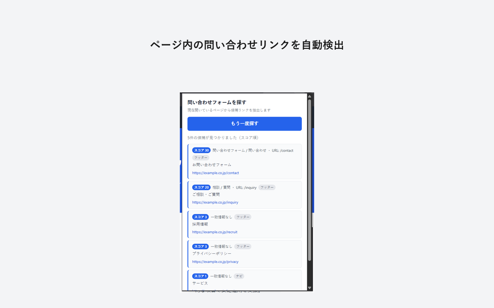
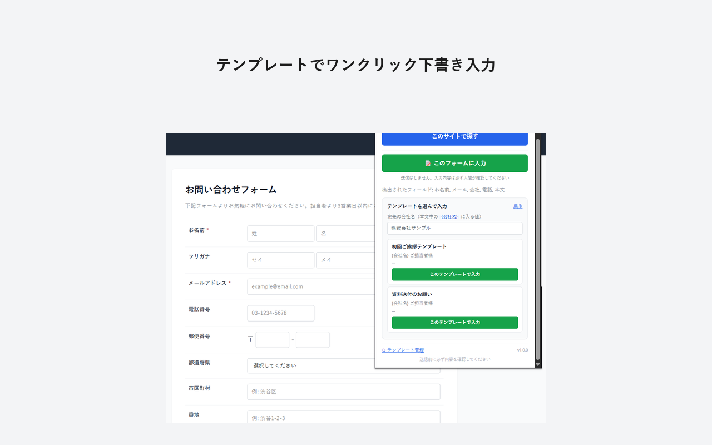
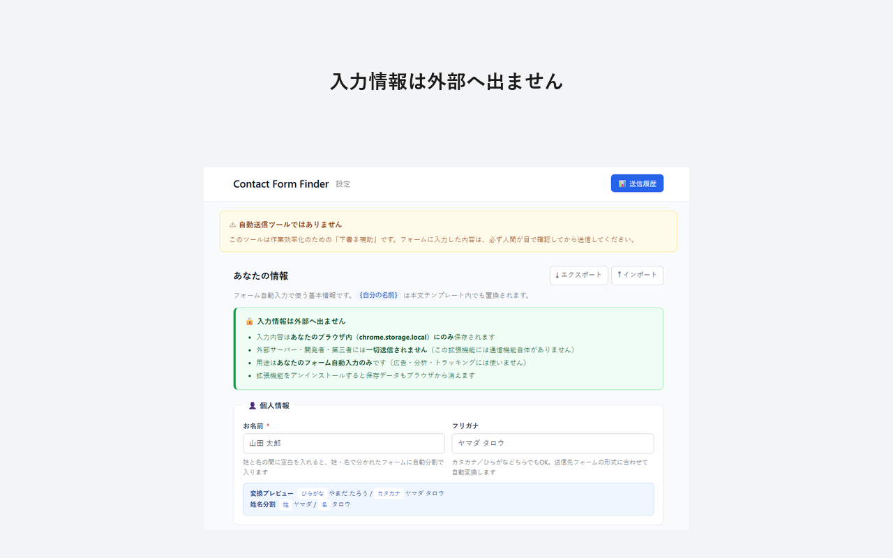
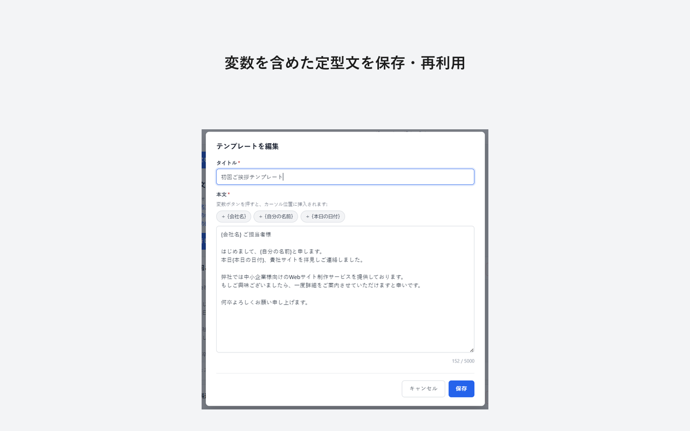
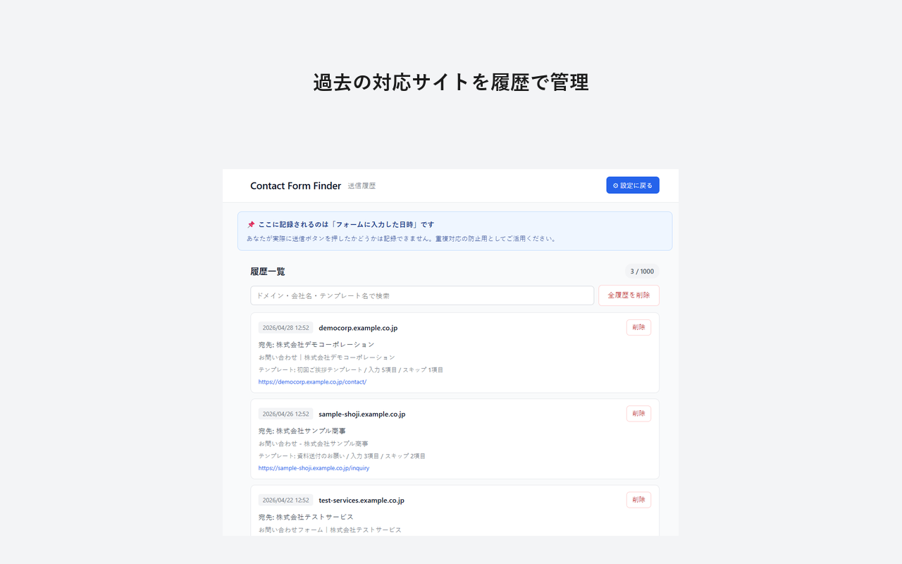

# Contact Form Finder

> 問い合わせフォームへのリンクを自動検出し、定型文テンプレートで下書き入力を補助する Chrome 拡張機能（送信は手動）。

[](LICENSE)
[](https://developer.chrome.com/docs/extensions/mv3/intro/)
[](#)

---

## 🎯 何をするツールか

クラウドワークスや個人事業主の **「企業サイトの問い合わせフォームに定型文を送る」営業事務作業** を効率化する Chrome 拡張機能です。

- ✅ サイトを開いてアイコンをクリックするだけで、問い合わせページの候補が一覧表示
- ✅ 登録済みの定型文をワンクリックでフォームに **下書き入力**
- ✅ 「営業お断り」の記載があるサイトは事前に警告して入力をブロック
- ✅ reCAPTCHA / hCaptcha などの認証も事前検知して通知
- ✅ 過去に対応したサイトを履歴で管理し、重複対応を防止
- ❌ **自動送信は一切しません**（送信ボタンは押されない）
- ❌ CAPTCHA 突破や大量自動送信などは行いません

## 👥 こんな方向け

- 個人事業主・フリーランスで、自分で営業フォーム送信を行っている方
- クラウドワークス等で営業代行案件を受けている方
- 月額の営業自動化ツール（5,000円〜）を使うほどの規模ではない方

---

## 📸 スクリーンショット

| | |
|---|---|
|  |  |
| **ページ内の問い合わせリンクを自動検出** | **テンプレートでワンクリック下書き入力** |
|  |  |
| **入力情報は外部へ出ません** | **変数を含めた定型文を保存・再利用** |


> 過去の対応サイトを履歴で管理

> ※ スクリーンショットは [`format_screenshots.py`](format_screenshots.py) で整形した画像を `screenshots/final/` に配置してください。詳細は [`screenshots/README.md`](screenshots/README.md) を参照。

---

## 🚀 インストール

### Chrome ウェブストアから（推奨）

[**Chrome ウェブストアで Contact Form Finder を見る**](https://chromewebstore.google.com/) ← 公開後にリンク差し替え

「Chrome に追加」をクリックするだけでインストールできます。

### 手動インストール（開発者モード）

最新の開発版を試したい方向けの手順です:

1. このリポジトリをクローンまたは [Releases](https://github.com/your-username/contact-form-finder/releases) から ZIP をダウンロード
2. ZIP を任意の場所に展開
3. Chrome で `chrome://extensions/` を開く
4. 右上の「**デベロッパーモード**」を ON
5. 「**パッケージ化されていない拡張機能を読み込む**」をクリック
6. 展開したフォルダを選択

---

## 📖 使い方

### 1. 初期設定

1. インストール後、ツールバーのアイコンを右クリック →「オプション」、または `chrome://extensions/` から「拡張機能のオプション」を開く
2. 「あなたの情報」セクションに氏名・連絡先・住所などを入力 → 「設定を保存」
3. 「定型文テンプレート」で `+ 新しいテンプレートを作成` から営業文を登録（最大10件）

   テンプレート本文中で使える変数:
   - `{会社名}` ＝ 宛先（送信先）の会社名（送信ページから自動推測）
   - `{自分の名前}` ＝ 設定の「お名前」
   - `{本日の日付}` ＝ 入力時の日付（自動）

### 2. 問い合わせフォームを探す

1. 営業先の Web サイトを開く
2. ツールバーのアイコンをクリック
3. 「**このサイトで探す**」を押す
4. 検出された問い合わせリンクから 1 つ選んで遷移

### 3. フォームに下書き入力

1. 問い合わせフォームのページで再度ポップアップを開く
2. 「**📝 このフォームに入力**」を押す
3. 検出された宛先会社名を確認（必要に応じて編集）
4. テンプレートを選択 → 確認ダイアログで「OK」
5. フォームに値が入力される（同時に本文がクリップボードにもコピー）
6. **必ず内容を目視確認してから手動で送信**

### 4. 履歴を確認

1. オプションページの右上「📊 送信履歴」をクリック
2. 過去対応したサイトの一覧を確認・検索・削除
3. 同じサイトを再度開くと、ポップアップに「○日前に対応済み」と表示されます

---

## 🔒 プライバシー

- 入力されたすべての情報は、あなたのブラウザ内（`chrome.storage.local`）にのみ保存されます
- 外部サーバー・開発者・第三者には **一切送信されません**（拡張機能内に通信機能自体がありません）
- 広告・分析・トラッキング目的での利用は一切ありません
- 拡張機能をアンインストールするとデータも自動的にブラウザから消えます

→ 詳細: [プライバシーポリシー](https://your-username.github.io/contact-form-finder/privacy-policy)

---

## 🛠 開発者向け

### ファイル構成

```
contact-finder/
├── manifest.json           Manifest V3 設定
├── popup.html / .css / .js ポップアップUI
├── options.html / .css / .js オプション・テンプレ管理
├── history.html / .js      送信履歴ページ
├── icons/                  16/48/128px アイコン
├── lib/
│   ├── keywords.js         検出キーワード定義
│   ├── detector.js         営業お断り/CAPTCHA検知
│   ├── finder.js           問い合わせリンク検出
│   ├── autofill.js         フォーム自動入力（content script）
│   ├── format.js           共通フォーマット関数
│   └── storage.js          chrome.storage ラッパー
├── docs/                   GitHub Pages（プライバシーポリシー）
├── screenshots/            ストア用スクリーンショット
├── generate_icons.py       アイコン再生成スクリプト
├── format_screenshots.py   スクリーンショット整形スクリプト
├── build_zip.py            配布用ZIP生成スクリプト
├── requirements.txt        Python 依存（開発時のみ）
├── LICENSE
└── README.md
```

### ローカルでの動作確認

```bash
# 1. リポジトリをクローン
git clone https://github.com/your-username/contact-form-finder.git
cd contact-form-finder

# 2. Chrome で chrome://extensions/ を開く
# 3. デベロッパーモード ON → 「パッケージ化されていない拡張機能を読み込む」
# 4. このディレクトリを選択
```

コード変更後は `chrome://extensions/` で **🔄 再読み込み** ボタンを押すと反映されます。

### 配布用 ZIP の生成

```bash
python build_zip.py
# → contact-finder-v<version>.zip が生成される
```

### スクリーンショット整形

```bash
pip install -r requirements.txt
# screenshots/raw/ に画像を配置してから:
python format_screenshots.py
# → 1280×800 整形済み画像が screenshots/final/ に出力される
```

### アイコン再生成

```bash
pip install -r requirements.txt
python generate_icons.py
# → icons/icon{16,48,128}.png が再生成される
```

### 技術スタック

- **Manifest V3**
- **Vanilla JavaScript**（外部ライブラリ・フレームワーク不使用）
- **chrome.storage.local** でデータ永続化（外部送信なし）
- **chrome.scripting.executeScript** で content script を都度注入

### キーワード追加・スコア調整

検出精度をチューニングする場合は [`lib/keywords.js`](lib/keywords.js) を編集してください。テキストキーワード・URLパターン・スコア値・フッター加点などをこのファイルだけで集約しています。

---

## 📜 ライセンス

[MIT License](LICENSE) — Copyright © 2026 Yuki Yokoyama

---

## 📮 連絡先

- バグ報告・機能要望: [GitHub Issues](https://github.com/your-username/contact-form-finder/issues)
- メール: [your-email@example.com](mailto:your-email@example.com)

---

## 🤝 コントリビューション

- Issue・Pull Request 歓迎です
- 大きな変更を入れる前に、まず Issue で相談していただけると助かります
- バグ報告には、再現手順と Chrome のバージョンを明記してください
